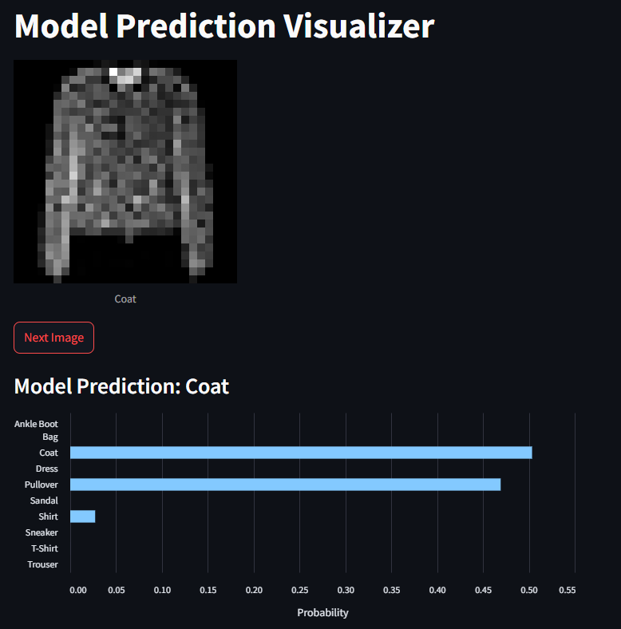

# AI Clothes Identifier Trainer and Visualiser
This repository features PyTorches basic AI training tutorial with a web interface to visualize the models capabilities. 
## Requirements
To train the model you will need to have the python torch module installed. In order to use the Prediction Visualizer, you will also need the streamlit module. I recommend using a virtual environment. Once you're ready to download the requirements, run:
```bash
pip install -r requirements.txt
```
This may take some time.
## Training
There is a model included in this repository. However, if you would like to train one from scratch, simply delete the .bt file. To train the model run:
```bash
python train.py
```
Note: You can adjust the number of epochs (# of times iterated though the trainig dataset) by updating the epochs varaible.
## Visualization
To visualize what the model sees and predicts, you can use the PredictionVisualizer.py script. This script uses Streamlit to display the image, captioned by what it is, and what the model predicts the image is. There is also a nifty table of probabilities to visualize the models confidence in its prediction.

To run this application, run:
```bash
streamlit run PredictionVisualizer.py
```
This will brring a streamlit webpage online that by default can be visited at http://localhost:8501/

The page will look like this:


